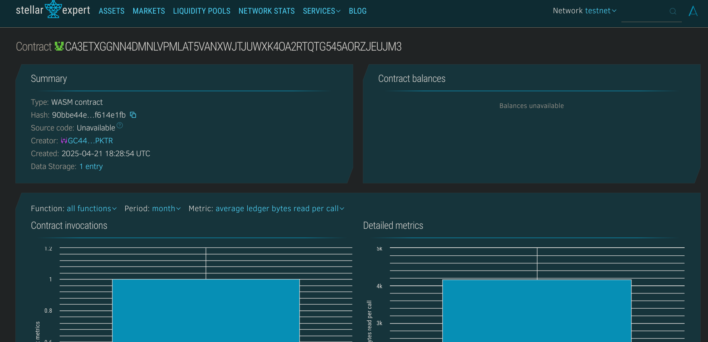

# Work History Tracker

## Project Description
A blockchain-based system for recording and verifying professional work history. It enables individuals to register job experiences and organizations to validate them securely on-chain using Soroban smart contracts.

## Project Vision
To provide a tamper-proof, verifiable, and universally accessible digital ledger of professional work experience for individuals around the world.

## Key Features
- 📝 **Add Work Records**: Users can add their work experiences with relevant details.
- ✅ **Verification System**: Organizations can verify the records to ensure authenticity.
- 🔍 **View Record**: Retrieve individual work records by ID.
- 📊 **Track Total Records**: Keep a count of total work records submitted.

## Future Scope
- 🆔 **Decentralized Identity (DID) Integration**: Link verified records with on-chain identity.
- 🔗 **Company Registry**: Maintain verified company profiles for employer authenticity.
- 🌐 **Global Resume**: Generate a verified public profile from blockchain records.
- 🔐 **Permissioned Views**: Allow users to share work records selectively with employers or agencies.

## Contract Details
CA3ETXGGNN4DMNLVPMLAT5VANXWJTJUWXK4OA2RTQTG545AORZJEUJM3
